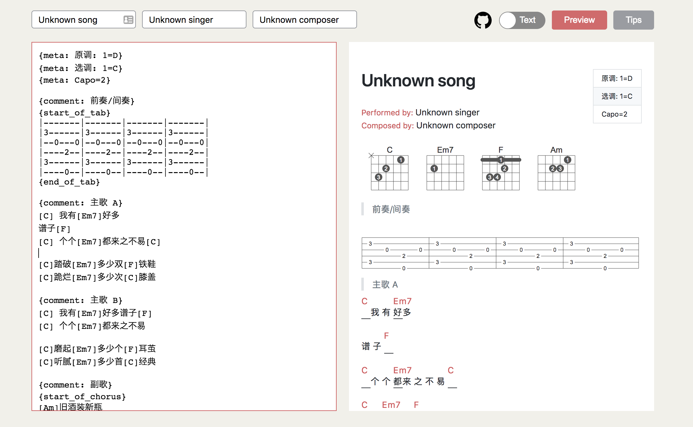
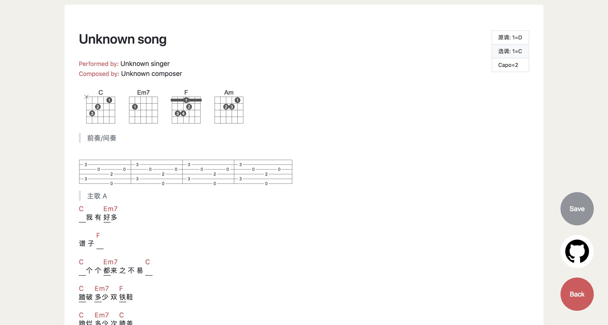
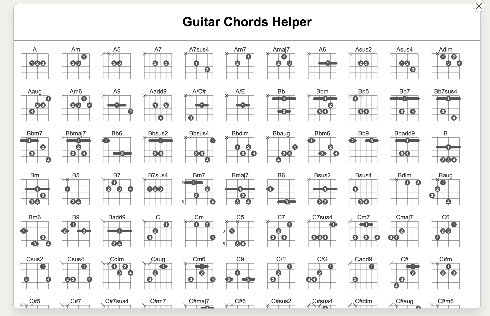

# Guitar-Editor

A portable guitar editor is coded based on react.js, inspired by Markdown and LaTex.

The chords and tab paragraphs components are based on `<svg/>` tech.

## Demo

[Click here to see the demo](https://haixiang6123.github.io/guitar-editor/#/)

## ScreenShot






## Directory

```tree
├── README.md
├── Screenshots         # Screen shots
├── package-lock.json
├── package.json
├── public
├── src                 # Source codes
└── yarn.lock
```

## How to run

```bash
$ npm install

$ npm start
```

```$xslt
$ npm run build         # To build this project
```

## Future

This project is written in the period of my final week, so there are some parsing parts that are not the most optimized one.
For example, if you type really fast in the `<textarea/>` element, the editor might have some 'stuck' behaviors.

If you are interested in this guitar editor, please help me to improve the parsing part.
